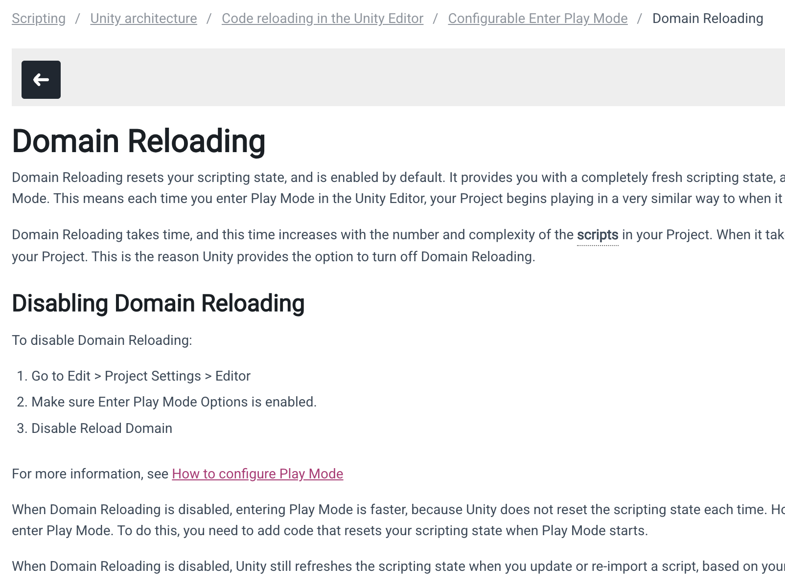

# ScriptableSingleton

`ScriptableSingleton<>` 是一个泛型抽象类，用于创建编辑器状态的单例模式，可以跨项目存在于本地电脑。

<!-- more -->

## 背景知识

目前已知静态变量在 [域重新加载 Domain Reload](https://docs.unity3d.com/2022.3/Documentation/Manual/DomainReloading.html) 后会置为初始值，不会保留状态。



/// caption
Domain Reload 文档截图
///

### 当关闭域重新加载时

1. 对于运行时的脚本，推荐使用 `[RuntimeInitializeOnLoadMethod(RuntimeInitializeLoadType.SubsystemRegistration)]` 特性去重置静态变量和事件注册和注销。
2. 对于编辑器脚本，推荐使用 `[InitializeOnEnterPlayMode]` 特性去重置静态变量和事件注册和注销。

## 解决方案

- 官方提供了 `ScriptableSingleton<>` 来解决编辑器状态的单例模式，还提供了 `FilePathAttribute` 特性来保存文件路径。

- 这是一个不显示在 `Assets` 文件夹下的一个单例文件，根据 `FilePathAttribute` 特性配置去设置文件路径，`FilePathAttribute` 的 `Location` 枚举有两个选择：`ProjectFolder` 和 `PreferencesFolder`。

``` csharp { .yaml .copy title="ProjectFolder" } 
namespace Yuumix.OdinToolkits.Common.Editor.Localization
{
    // ProjectFolder 是指这个文件所在的根目录是项目文件夹，是和 Assets 文件夹同级的目录，所以在编辑器中看不到它
    [FilePath("OdinToolkitsTemplate/ProjectFolder/EditorProjectFolderSingleton.yaml", FilePathAttribute.Location.ProjectFolder)]
    public class EditorProjectFolderSingleton : ScriptableSingleton<EditorProjectFolderSingleton>
    {
        // ...
    }
```

``` csharp { .yaml .copy title="PreferencesFolder"}
namespace Yuumix.OdinToolkits.Common.Editor.Localization
{
    // PreferencesFolder 是指用户本地的文件夹，例如：Unity 5.x ，这个编辑器设置可以跨项目调用
    // 例如路径可能是：C:\Users\Administrator\AppData\Roaming\Unity\Editor\Preferences\OdinToolkitsLearnTemplate\EditorPreferenceFolderStateFile.yaml
    [FilePath("OdinToolkitsLearnTemplate/EditorPreferenceFolderStateFile.yaml", FilePathAttribute.Location.PreferencesFolder)]
    public sealed class EditorPreferenceFolderSingleton : ScriptableSingleton<EditorPreferenceFolderSingleton>
    {
        // ...
    }
}
```
!!! success "总结"
    
    - 使用可能性不高，保存时候，需要搭配 `FilePath` 特性使用，`PreferencesFolder` 是保存在本地的用户配置，如：../Unity 5.x/... ，而 `ProjectFolder` 是保存在项目下的，
    不在 `Assets` 文件中，至少不适合插件使用这个单例，如果需要单例，可以自定义一个单例的 `ScriptableObject` 文件。
    - 不是很推荐使用，如果有更合适的使用场景，可以评论建议！
    


    


