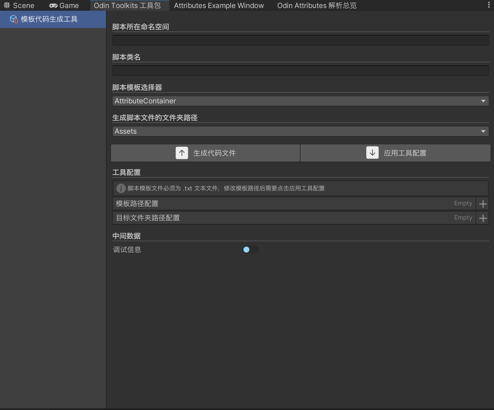
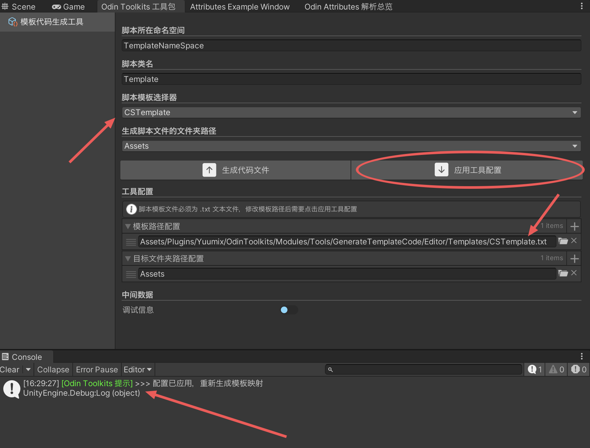
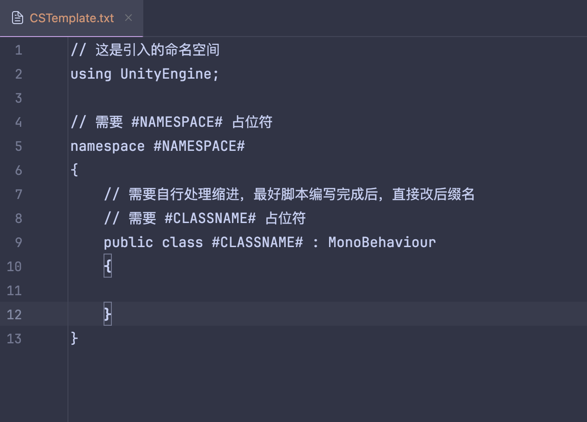

# GenerateTemplateCode

## 介绍

生成模板代码工具，用于快速生成脚本模板，减少重复代码编写。

## 工具截图

/// caption
生成模板代码工具总览
///

/// caption
工具使用截图
///

/// caption
脚本模板文件参考
///

## 用法

1. 找到菜单路径 Tools/Odin Toolkits/Windows/Tools Package，Mac 快捷键 = Command + Shift + Option + T
2. 配置脚本模板路径，选择 .txt 文件，将它拖入脚本模板路径输入框，自动读取
3. 点击应用配置，生成脚本模板路径映射（后台，用户无感）
4. 配置目标文件夹路径，可以同时存储多个文件夹路径，不需要每次都拖拽
5. 设置脚本类名
6. 选择脚本模板
7. 选择脚本文件生成路径
8. 点击生成

## 添加脚本模板

1. 新建脚本模板文件，文件名必须以 `.txt` 结尾
2. 模板文件中的命名空间使用 `#NAMESPACE#` 占位，类名使用 `#CLASSNAME#` 占位
3. 拖拽脚本文件到配置列表路径
4. 配置脚本模板路径，并且应用，即可下拉选择模板

!!! tip "提示"

    模板文件需要注意引入的命名空间，如果有修改，需要及时修改模板。

